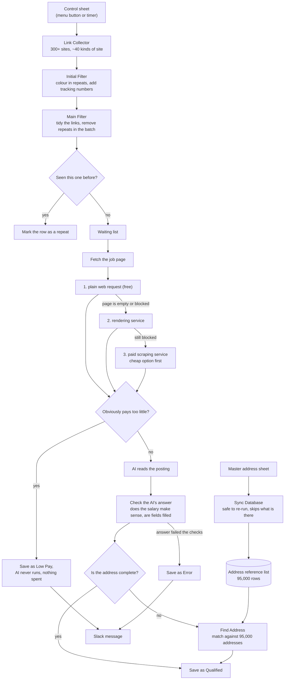

# JobLinkOS

**A system that takes a raw job link and turns it into a finished, address-checked record in a database, without anyone doing it by hand.**

It gathers job listings from more than 300 company career sites, throws out the ones already seen, reads each posting with AI, fills in any missing street address from a reference list of 95,000 addresses, and files a clean record. If anything is skipped or goes wrong, it says so in Slack.

A client's team used to do every one of those steps manually. Two months after this went live, they were finishing **5.8 times as many job links per month**.

This repository holds cleaned-up copies of the automation workflows, plus the story of how it was built. It is a portfolio piece, not a product you can install. See [What is and is not here](#what-is-and-is-not-here).

---

## The problem

The client's team did four jobs by hand, for every batch, every day:

1. **Collecting links.** Open 300+ career sites one at a time, sometimes through a VPN, and copy and paste every job link into a spreadsheet.
2. **Checking links.** Search the database for each link they had just collected. Most turned out to be ones they already had.
3. **Copying the details.** Open every remaining link and copy 10+ pieces of information per job, one field at a time.
4. **Finding the address.** Look up the exact street address in a master list, job by job. This was the worst of the four.

It worked, and it could not grow. Output sat between 2,870 and 3,826 links a month, and every one of those numbers depended on somebody being at a desk.

## What I built

One Google Sheet is the control panel. Everything below starts from a button in its menu.

| Step | What happens |
|---|---|
| **Link Collector** | One click visits all 300+ career sites and collects every job link, keeping only the postings in the states the client hires in. Nearly 40 different kinds of site, each one fetched the way that site needs. |
| **Initial Filter** | The sheet colours in four different kinds of repeat, gives every row its own tracking number, and passes the clean batch along. |
| **Main Filter** | Each link is tidied up, checked against the others in the same batch, then checked against the full master list. Only genuinely new links go forward. |
| **Data Scraper** | Each page is fetched using the cheapest method that works. Jobs that obviously pay too little are dropped before the AI ever runs. The AI then reads the posting field by field, and the answer is checked before anything is saved. |
| **Find Address** | Any record the scraper marked as having an incomplete address gets filled in from the reference list. |
| **Sync Database** | Keeps that 95,000-row address list up to date with the master sheet. You can run it as often as you like: it skips rows that are already there, so it never creates duplicates. |
| **Notify** | Every skip or failure posts a Slack message saying which record and why. Records that saved fine stay quiet. |

Two decisions did most of the heavy lifting:

**Start cheap, and only pay more when you have to.** Every page fetch tries the free way first, a plain web request. If that does not work, it tries a rendering service. If that still does not work, it uses a paid scraping service, and only for the page that actually needed it. The same idea applies inside the paid service too: its cheaper option is tried before its expensive one, and if a site fails, the system *remembers* that for seven days rather than forever, so a site that fixes itself goes back to the cheap route. Going through this properly cut the scraping bill by **42%** without collecting any less.

**Do not assume an empty answer is the only kind of bad answer.** The worst mistakes in this system were never blank pages. They were "prove you are not a robot" pages: full of content, and they looked like a page that had loaded fine. So every fetch result is checked for what it actually is (proper JSON, proper XML, enough real text, none of the tell-tale robot-check wording) before it counts as a success.

## Before and after

| | Before, all by hand | After, with JobLinkOS |
|---|---|---|
| **Collecting links** | Open 300+ sites one by one, sometimes on a VPN, copy and paste each link | One click, every site, only the states that count |
| **Removing repeats** | Search the database for every link, manually | Two passes: colour-coded in the sheet, then checked against the full master list |
| **Reading a posting** | Open the link, copy 10+ fields one at a time | AI reads it, roughly one record every 30 seconds |
| **Completing an address** | Look through the master list job by job | Matched automatically against 95,000 addresses, with a backup plan if nothing fits |
| **Things going wrong** | Noticed whenever somebody happened to spot it | A Slack message naming the record and the reason |
| **Work per batch** | Hours | Two clicks |

## How it all fits together

## The result

Job links finished per month. The automation went live at the start of May.

| Month | Links finished | |
|---|---:|---|
| January | 3,565 | by hand |
| February | 3,411 | by hand |
| March | 3,826 | by hand |
| April | 2,870 | by hand |
| **May** | **12,599** | automated |
| **June** | **14,822** | automated |
| **July** | **19,786** | automated |

**5.8 times the manual average.** June is the month I point to. The client was mostly away from their desk, and the system kept collecting, checking and filling in records on its own.

Separately, an audit found the scraping service had quietly been charging every single request at its most expensive rate. Fixing that **cut scraping costs by 42%**, with no drop in what was collected.

## What it is built with

| | |
|---|---|
| **Runs the workflows** | n8n, self-hosted |
| **Control panel** | Google Sheets and Google Apps Script |
| **Databases** | Airtable for the job records, Supabase (PostgreSQL) for the address list |
| **AI** | DeepSeek Chat v3, through OpenRouter |
| **Fetching pages** | plain web request first, then Jina AI Reader, then the Decodo scraping service |
| **Alerts** | Slack, sent through a small relay so the Slack address never sits inside a client workflow |
| **Version control** | GitHub, for the workflow files |

### Where AI is used, and where it is not

**In the system:** AI reads the job pages and fills in the fields. Every answer it gives is then checked by ordinary rules, does the salary make sense, are the fields the right shape, is the address complete, before anything is saved. The AI never gets the final say.

**In building it:** I used Claude to help draft code and wording. The design, the decisions, the testing and the client relationship are mine, and I read everything the AI writes before it goes anywhere near production.

## My role

**Sole automation engineer** on this system: I designed it, built it, and still look after it. I wrote every workflow and every Apps Script function in it, did the testing, and handled the client side. The version markers scattered through the code (`v27`, `v43`, `v82`, and so on) are the running record of that upkeep. Each one is tied to a specific thing that went wrong in production and the fix for it.

---

## What is and is not here

These are cleaned-up copies, shared with the client's permission. They will not run as they are, and that is on purpose.

**Taken out of every file:**

- Every password, key and token (replaced with `<PLACEHOLDER>` markers)
- Account names and IDs, workflow IDs, run IDs, and anything identifying the server it runs on
- The web address of the n8n server, and every database, table, sheet and project ID
- Every client and employer name, and any web address, file path or note that would point to one

**One workflow is trimmed rather than left out.** `00-link-collector.structure-only.json` keeps its real 26-step shape and most of its code, but one step, `Probe Careers API`, has been cut from about 386 KB down to about 16 KB. In the real system that step holds nearly 40 hand-written handlers, one for each kind of career site the client watches, and that list of sites is effectively the client's customer list. The trimmed version keeps what goes in and what comes out, keeps the location-reading logic, keeps the cost-saving logic, and includes two example handlers standing in for the 40 real ones. The engineering is here. The client's list is not.

**Not published at all:** the One Link Companies workflow, the Google Apps Script menu code (that is going in a separate repository), and every test file, backup and data export from the working folder.

| File | Steps | What it shows |
|---|---:|---|
| [`00-link-collector.structure-only.json`](workflows/00-link-collector.structure-only.json) | 26 | Handling many kinds of site from one workflow, choosing the right handler per site, saving money on fetches, reporting the day's totals |
| [`01-main-filter.json`](workflows/01-main-filter.json) | 13 | Tidying up links, removing repeats, checking against the master list, writing the result back to the sheet, raising an alert on failure |
| [`02-data-scraper.json`](workflows/02-data-scraper.json) | 30 | Three ways of fetching a page in order of cost, skipping low-paying jobs before spending on AI, AI reading, checking the AI's answer, saving to the right place |
| [`03-find-address.json`](workflows/03-find-address.json) | 10 | Searching for possible address matches, ranking them, and falling back gracefully when nothing fits |
| [`04-sync-address-database.json`](workflows/04-sync-address-database.json) | 7 | Uploading in batches, safely, so running it twice never doubles anything |
| [`05-notify-slack-relay.json`](workflows/05-notify-slack-relay.json) | 3 | The pattern for handling secrets: the workflow calls a small relay, and the relay is the only thing that holds the Slack credentials |

### How to look at them

Import any file into n8n (**Workflows, then Import from File**) to see it laid out visually, or just read the JSON. The `jsCode` sections inside the Code steps hold the actual logic, along with comments explaining why each part works the way it does.

To genuinely run one you would need to plug in your own accounts and replace every `<PLACEHOLDER>` with your own IDs.

---

## The full case study

The longer write-up, with screenshots of every workflow and a demo video, is at
**[emayourvirtualassistant.com/projects/joblinkos](https://emayourvirtualassistant.com/projects/joblinkos/)**.

Built by **[Ema](https://emayourvirtualassistant.com)**, automation and data operations.
Open to automation projects, contract work, and full-time roles.
