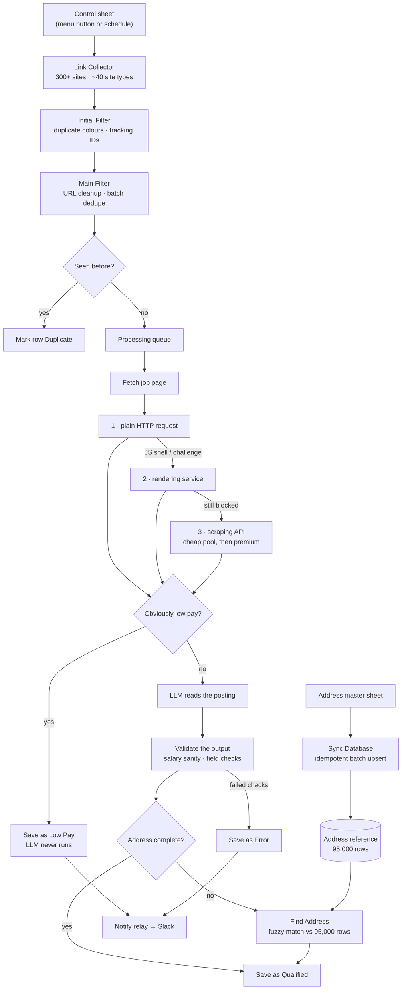

# JobLinkOS

**An end-to-end pipeline that turns a raw job link into a qualified, address-verified database record.**

It collects job listings from 300+ company career sites, filters out duplicates, reads each posting with an LLM, completes missing addresses from a 95,000-row reference database, and files a clean record — with a Slack message whenever something is skipped or fails.

A client's team used to do every one of those steps by hand. Two months after launch, monthly output was **5.8× the manual average**.

This repository holds **sanitized exports of the n8n workflows** plus the case study. It is a portfolio artefact, not a product — see [What is and isn't here](#what-is-and-isnt-here).

---

## The problem

The client's team ran four chores by hand, for every batch, every day:

1. **Link collecting** — open 300+ career sites one at a time, sometimes through a VPN, and copy-paste every job link into a spreadsheet.
2. **Link checking** — search the database for each collected link. Most turned out to be repeats.
3. **Data scraping** — open every surviving link and copy 10+ fields per job, one field at a time.
4. **Address finding** — hunt down the exact street address in a masterlist, job by job. The most tedious step of the four.

It worked, and it did not scale. Output sat between 2,870 and 3,826 links a month, and every number depended on somebody being at a desk.

## What I built

One Google Sheet is the control panel. Everything below starts from its menu.

| Stage | What happens |
|---|---|
| **Link Collector** | One click walks all 300+ career sites and collects every job link, keeping only postings in the allowed states. Close to 40 site types, each fetched its own way. |
| **Initial Filter** | The sheet colour-codes four kinds of duplicate, assigns each row a permanent tracking ID, and hands the clean batch on. |
| **Main Filter** | Each link is normalised, de-duplicated within the batch, then checked against the full masterlist. Only genuinely new links join the queue. |
| **Data Scraper** | Each page is fetched — cheapest method first — obviously low-paying posts are dropped before the LLM runs, the LLM reads the posting field by field, and the output is validated before anything is saved. |
| **Find Address** | Records the scraper flagged as having an incomplete address are completed from the reference database by fuzzy match and scoring. |
| **Sync Database** | Keeps the 95,000-row address reference in step with the master sheet. Re-runnable: existing rows are skipped, so it never creates duplicates. |
| **Notify (relay)** | Every skip or failure posts to Slack with its reason. Qualified records save silently. |

Two design decisions carried most of the weight:

**Escalate, don't over-provision.** Every fetch tries the free path first — a plain HTTP request — then a rendering service, then a paid scraping API, and only for the page that actually needs it. The same shape applies one level down, inside the paid API: its cheap proxy pool is tried before its expensive one, and a host that fails is *remembered* for seven days rather than forever. Auditing that tiering cut scraping costs by **42%** with no change to coverage.

**Judge results by shape, never by emptiness.** The worst misses in this system were never blank pages — they were bot-challenge pages, full of HTML, that looked like successful fetches. Every fetch result is checked for what it *is* (valid JSON, valid XML, enough real text, no challenge markers) before it counts as a success.

## Before / after

| | Before · all by hand | After · JobLinkOS |
|---|---|---|
| **Collecting links** | Open 300+ sites one by one, sometimes via VPN, copy-paste each link | One click, all sites, allowed-state jobs only |
| **Removing duplicates** | Search the database for every link, manually | Two layers: colour-flagged in the sheet, then checked against the full masterlist |
| **Reading a posting** | Open the link, copy 10+ fields one at a time | LLM extraction, roughly one record every 30 seconds |
| **Completing an address** | Hunt the masterlist job by job | Fuzzy match and scoring against 95,000 rows, with fallback |
| **Failures** | Noticed when someone spots them | Slack message naming the record and the reason |
| **Effort per batch** | Hours | Two clicks |

## How it fits together

## Result

Completed job links per month. The automation went live at the start of May.

| Month | Links completed | |
|---|---:|---|
| January | 3,565 | manual |
| February | 3,411 | manual |
| March | 3,826 | manual |
| April | 2,870 | manual |
| **May** | **12,599** | automated |
| **June** | **14,822** | automated |
| **July** | **19,786** | automated |

**5.8× the manual average.** June is the month I point to: the client was mostly away from the desk, and the pipeline kept collecting, checking and filling records on its own.

Separately, an audit found the scraping service was quietly billing every request at its most expensive tier. Correcting that **cut scraping costs by 42%**, with no change to coverage or results.

## Stack

| | |
|---|---|
| **Orchestration** | n8n (self-hosted) |
| **Control surface** | Google Sheets + Google Apps Script |
| **Databases** | Airtable (job records), Supabase / PostgreSQL (address reference) |
| **LLM** | DeepSeek Chat v3 via OpenRouter |
| **Fetching** | direct HTTP → Jina AI Reader → Decodo Web Scraping API |
| **Alerting** | Slack, through a relay so no webhook URL ever reaches a client |
| **Version control** | GitHub (workflow JSON exports) |

### Where AI is used, and where it isn't

**In the pipeline:** an LLM reads job pages and fills in the fields. Every LLM output passes rule-based checks — salary sanity, field shape, address completeness — before anything is saved. The model is never the last word.

**In the build:** I used Claude as an assistant for drafting code and copy. The architecture, the decisions, the testing and the client relationship are mine, and I review everything the AI touches before it ships.

## My role

**Sole automation engineer** on this system: architecture, build, and ongoing maintenance. I designed the pipeline, wrote every workflow and Apps Script function in it, ran the testing, handled the client communication, and still maintain it — the version markers throughout the code (`v27`, `v43`, `v82`…) are the running record of that maintenance, each one tied to a specific failure found in production.

---

## What is and isn't here

These are **sanitized exports**, published with the client's permission. They will not run as-is, and that is deliberate.

**Removed from every file:**

- All credentials — API keys, tokens, and header auth values (replaced with `<PLACEHOLDER>` markers)
- Credential names and IDs, workflow IDs, execution IDs, instance metadata
- The n8n instance host, and every base, table, sheet and project identifier
- Every client and employer name, plus any host, path or comment that would identify one

**One workflow is reduced rather than removed.** `00-link-collector.structure-only.json` keeps the real 26-node shape and most of its code, but its `Probe Careers API` node — ~386 KB of hand-written handlers keyed to a specific client's target boards — is replaced by a ~16 KB version. That reduced node keeps the input/output contract, the state-detection logic, and the cost-tier escalation verbatim, and stands in two representative handlers for the ~40 real ones. The engineering is there; the client's list of employers is not.

**Not published at all:** the One Link Companies workflow, the Apps Script menu code (that belongs in a separate repo), and every test, backup and data export from the working folder.

| File | Nodes | What it shows |
|---|---:|---|
| [`00-link-collector.structure-only.json`](workflows/00-link-collector.structure-only.json) | 26 | Fan-out across many site types, per-site handler dispatch, cost-tier escalation, run reporting |
| [`01-main-filter.json`](workflows/01-main-filter.json) | 13 | URL normalisation, in-batch dedupe, masterlist check, row status write-back, error alerting |
| [`02-data-scraper.json`](workflows/02-data-scraper.json) | 30 | Three-way fetch escalation, pre-LLM cost gate, LLM extraction, output validation, routed writes |
| [`03-find-address.json`](workflows/03-find-address.json) | 10 | Candidate search, best-match scoring, graceful fallback when nothing matches |
| [`04-sync-address-database.json`](workflows/04-sync-address-database.json) | 7 | Idempotent batched upsert — safe to re-run, never duplicates |
| [`05-notify-slack-relay.json`](workflows/05-notify-slack-relay.json) | 3 | The secrets pattern: the workflow posts to a relay, the relay holds the credential |

### Reading them

Import any file into n8n (**Workflows → Import from File**) to see the canvas, or read the JSON directly — the `jsCode` fields in the Code nodes carry the logic and the comments explaining why each piece is the way it is.

To actually run one you would need to supply your own credentials and replace every `<PLACEHOLDER>` with your own identifiers.

---

## Case study

The full write-up, with the workflow screenshots and a demo video, is at
**[emayourvirtualassistant.com/projects/joblinkos](https://emayourvirtualassistant.com/projects/joblinkos/)**.

Built by **[Ema](https://emayourvirtualassistant.com)** — automation and data operations.
Open to automation projects, contract work, and full-time roles.
