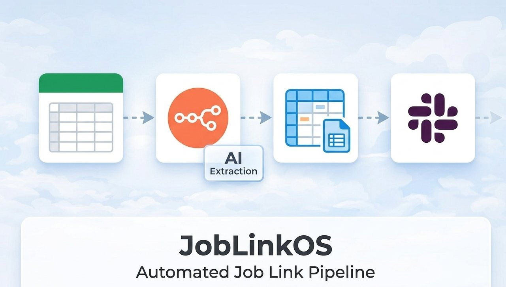
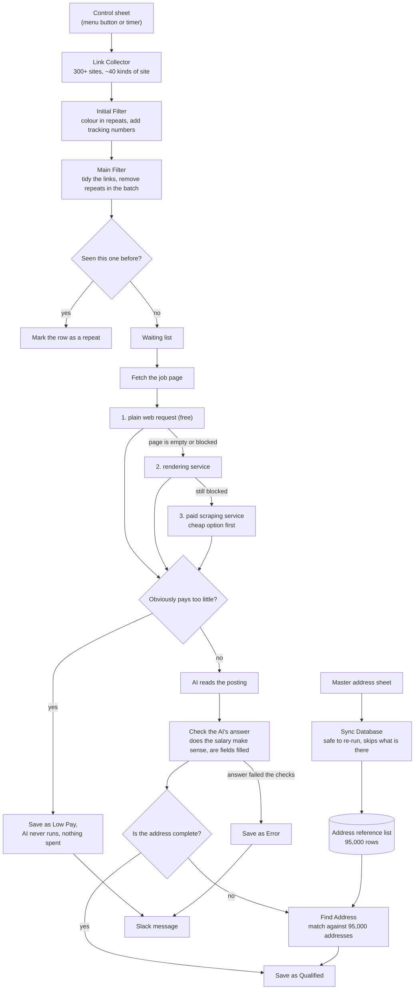

# JobLinkOS

**A system that takes a raw job link and turns it into a finished, address-checked record in a database, without anyone doing it by hand.**

It gathers job listings from more than 300 company career sites, throws out the ones already seen, reads each posting with AI, fills in any missing street address from a reference list of 95,000 addresses, and files a clean record. If anything is skipped or goes wrong, it says so in Slack.

A client's team used to do every one of those steps manually. Two months after this went live, they were finishing **5.8 times as many job links per month**.

JobLinkOS is my own system. This page shows what it does, how it fits together, and what it achieved. The workflows themselves are not published. If you want something like it for your business, see [Want a system like this?](#want-a-system-like-this)

---

## The problem

The client's team did four jobs by hand, for every batch, every day:

1. **Collecting links.** Open 300+ career sites one at a time, sometimes through a VPN, and copy and paste every job link into a spreadsheet.
2. **Checking links.** Search the database for each link they had just collected. Most turned out to be ones they already had.
3. **Copying the details.** Open every remaining link and copy 10+ pieces of information per job, one field at a time.
4. **Finding the address.** Look up the exact street address in a master list, job by job. This was the worst of the four.

It worked, and it could not grow. Output sat between 2,870 and 3,826 links a month, and every one of those numbers depended on somebody being at a desk.

## What I built

One Google Sheet is the control panel. Everything below starts from a button in its menu.

| Step | What happens |
|---|---|
| **Link Collector** | One click visits all 300+ career sites and collects every job link, keeping only the postings in the states the client hires in. Nearly 40 different kinds of site, each one fetched the way that site needs. |
| **Initial Filter** | The sheet colours in four different kinds of repeat, gives every row its own tracking number, and passes the clean batch along. |
| **Main Filter** | Each link is tidied up, checked against the others in the same batch, then checked against the full master list. Only genuinely new links go forward. |
| **Data Scraper** | Each page is fetched using the cheapest method that works. Jobs that obviously pay too little are dropped before the AI ever runs. The AI then reads the posting field by field, and the answer is checked before anything is saved. |
| **Find Address** | Any record the scraper marked as having an incomplete address gets filled in from the reference list. |
| **Sync Database** | Keeps that 95,000-row address list up to date with the master sheet. You can run it as often as you like: it skips rows that are already there, so it never creates duplicates. |
| **Notify** | Every skip or failure posts a Slack message saying which record and why. Records that saved fine stay quiet. |

Two decisions did most of the heavy lifting:

**Start cheap, and only pay more when you have to.** Every page fetch tries the free way first, a plain web request. If that does not work, it tries a rendering service. If that still does not work, it uses a paid scraping service, and only for the page that actually needed it. The same idea applies inside the paid service too: its cheaper option is tried before its expensive one, and if a site fails, the system *remembers* that for seven days rather than forever, so a site that fixes itself goes back to the cheap route. Going through this properly cut the scraping bill by **42%** without collecting any less.

**Do not assume an empty answer is the only kind of bad answer.** The worst mistakes in this system were never blank pages. They were "prove you are not a robot" pages: full of content, and they looked like a page that had loaded fine. So every fetch result is checked for what it actually is (proper JSON, proper XML, enough real text, none of the tell-tale robot-check wording) before it counts as a success.

## How it all fits together

```mermaid
flowchart TD
    A["Control sheet<br/>(menu button or timer)"] --> B["Link Collector<br/>300+ sites, ~40 kinds of site"]
    B --> C["Initial Filter<br/>colour in repeats, add tracking numbers"]
    C --> D["Main Filter<br/>tidy the links, remove repeats in the batch"]
    D --> E{"Seen this one before?"}
    E -- yes --> F["Mark the row as a repeat"]
    E -- no --> G["Waiting list"]

    G --> H["Fetch the job page"]
    H --> H1["1. plain web request (free)"]
    H1 -- "page is empty or blocked" --> H2["2. rendering service"]
    H2 -- "still blocked" --> H3["3. paid scraping service<br/>cheap option first"]

    H1 --> I{"Obviously pays too little?"}
    H2 --> I
    H3 --> I
    I -- yes --> J["Save as Low Pay,<br/>AI never runs, nothing spent"]
    I -- no --> K["AI reads the posting"]
    K --> L["Check the AI's answer<br/>does the salary make sense, are fields filled"]
    L --> M{"Is the address complete?"}
    M -- no --> N["Find Address<br/>match against 95,000 addresses"]
    M -- yes --> O["Save as Qualified"]
    N --> O
    L -- "answer failed the checks" --> P["Save as Error"]

    J --> Q["Slack message"]
    P --> Q

    R["Master address sheet"] --> S["Sync Database<br/>safe to re-run, skips what is there"]
    S --> T[("Address reference list<br/>95,000 rows")]
    T --> N
```

## The result

Job links finished per month. The automation went live at the start of May.

| Month | Links finished | |
|---|---:|---|
| January | 3,565 | by hand |
| February | 3,411 | by hand |
| March | 3,826 | by hand |
| April | 2,870 | by hand |
| **May** | **12,599** | automated |
| **June** | **14,822** | automated |
| **July** | **19,786** | automated |

**5.8 times the manual average.** June is the month I point to. The client was mostly away from their desk, and the system kept collecting, checking and filling in records on its own.

Separately, an audit found the scraping service had quietly been charging every single request at its most expensive rate. Fixing that **cut scraping costs by 42%**, with no drop in what was collected.

## What it is built with

| | |
|---|---|
| **Runs the workflows** | n8n, self-hosted |
| **Control panel** | Google Sheets and Google Apps Script |
| **Databases** | Airtable for the job records, Supabase (PostgreSQL) for the address list |
| **AI** | DeepSeek V4 Flash, called through an AI model API |
| **Fetching pages** | plain web request first, then Jina AI Reader, then a paid scraping service |
| **Alerts** | Slack, sent through a small relay so the Slack address never sits inside a workflow |
| **Version control** | GitHub (private), for the workflow files |

### Where AI is used, and where it is not

**In the system:** AI reads the job pages and fills in the fields. Every answer it gives is then checked by ordinary rules, does the salary make sense, are the fields the right shape, is the address complete, before anything is saved. The AI never gets the final say.

**In building it:** I used Claude to help draft code and wording. The design, the decisions, the testing and the client relationship are mine, and I read everything the AI writes before it goes anywhere near production.

## My role

**Sole automation engineer** on this system: I designed it, built it, and still look after it. I wrote every workflow and every Apps Script function in it, did the testing, and handled the client side. Every change since launch carries a version marker (`v27`, `v43`, `v82`, and so on), and each one is tied to a specific thing that went wrong in production and the fix for it.

---

## What is in this repository

This is a showcase, not a download. The workflows, code and setup that run JobLinkOS are not published.

**The parts of the system**

| Part | What it does |
|---|---|
| Link Collector | Handles nearly 40 kinds of careers site from one workflow, tries three fetch routes in order of cost, and reports the day's totals |
| Main Filter | Removes repeats in batches, checks against the master list, writes every result back, and sends a separate alert for each kind of failure |
| Data Scraper | Fetches the cheapest way first, drops low-paying jobs before the AI runs, has the AI read the posting, then checks the AI's answer |
| Find Address | Searches 95,000 address rows for each record, scores the candidates, and refuses a weak match |
| One Link Companies | Handles pages that list every job at once: the AI returns only the titles, and the rest is cut out of the page |
| Sync Address Database | Uploads in batches, so running it twice never doubles anything |
| Notify Slack | One relay holds the Slack credentials, and every other part only sends it the numbers |
| Slack Bot | Runs the day's check and answers questions from Slack, with a report that only mentions exceptions |

**Also worth reading:** [When the code looked right and wasn't](docs/when-the-code-looked-right.md),
four real cases where nothing failed, the run reported success, and the answer was still
wrong. It is the shortest way to see how I work.

---

## Want a system like this?

If your team spends hours copying information from websites into a spreadsheet, a system
like this can take that over: collecting, removing repeats, reading each page, and filing a
clean record. Tell me what you collect and where it needs to end up, and I will tell you
what it would take.

- **Full case study**, with screenshots of every workflow and a demo video:
  [emayourvirtualassistant.com/projects/joblinkos](https://emayourvirtualassistant.com/projects/joblinkos/)
- **Get in touch:** [emayourvirtualassistant.com/#contact](https://emayourvirtualassistant.com/#contact)
- **LinkedIn:** [linkedin.com/in/emayourva](https://www.linkedin.com/in/emayourva/)

Built by **[Ema](https://emayourvirtualassistant.com)**, automation and data operations.
Open to automation projects, contract work, and full-time roles.

---

© 2026 Ema Your VA. All rights reserved. This repository is a portfolio showcase. See [LICENSE](LICENSE).
